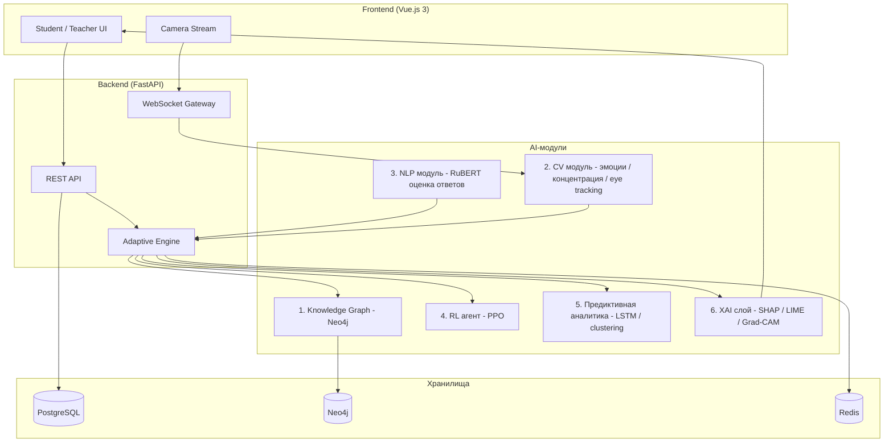

# AdaptIQ


**AdaptIQ** — мультимодальная адаптивная образовательная платформа с искусственным интеллектом.

## Описание проекта и научная новизна

AdaptIQ объединяет в единой архитектуре шесть взаимосвязанных AI-модулей, обеспечивающих
адаптацию образовательного процесса к когнитивному и эмоциональному состоянию обучающегося
в реальном времени. Научная новизна работы заключается в мультимодальном слиянии
(multimodal fusion) сигналов компьютерного зрения, обработки естественного языка и
поведенческих метрик в единый индекс когнитивной нагрузки, на основе которого
обучаемый с подкреплением (RL) агент принимает решения об адаптации учебного материала,
а слой объяснимого искусственного интеллекта (XAI) делает эти решения интерпретируемыми
для преподавателя и студента.

## Архитектура



## AI-модули и методы

1. **Knowledge Graph (Neo4j)** — граф знаний предметной области, связи между концепциями и уроками
2. **CV модуль**:
   - CNN на базе EfficientNet-B0 (transfer learning) — классификация эмоций
   - MediaPipe Face Mesh — отслеживание взгляда (eye tracking)
   - Поведенческий анализ концентрации внимания
   - Grad-CAM — визуализация внимания CNN
3. **NLP модуль**:
   - RuBERT (fine-tuned) — оценка качества открытых текстовых ответов
   - sentence-transformers — семантическое сравнение ответов с эталоном
   - Attention visualization — визуализация весов внимания трансформера
4. **RL агент**:
   - PPO (Proximal Policy Optimization, Stable-Baselines3) — выбор следующего учебного материала
   - Кастомный Gym environment, моделирующий обучающуюся сессию
   - Reward shaping на основе прогресса и когнитивной нагрузки
5. **Предиктивная аналитика**:
   - LSTM — предсказание результата экзамена по динамике сессий
   - K-Means + UMAP — кластеризация студентов по поведенческим паттернам
   - Autoencoder — детекция аномального поведения
   - IRT (Item Response Theory) — оценка сложности вопросов и способностей студента
6. **XAI слой**:
   - SHAP — атрибуция признаков для табличных моделей
   - LIME — локальные интерпретируемые объяснения
   - Grad-CAM — визуализация значимых областей изображения
   - Attention Visualization — визуализация внимания NLP-модели

## Стек технологий

| Слой | Технологии |
|---|---|
| Backend | FastAPI, Python 3.11, SQLAlchemy, Pydantic |
| ML/DL | PyTorch, HuggingFace Transformers, Stable-Baselines3, scikit-learn |
| CV | MediaPipe, OpenCV, EfficientNet-B0 |
| NLP | RuBERT, sentence-transformers |
| Frontend | Vue.js 3, Vite, Pinia, Chart.js, D3.js |
| Базы данных | PostgreSQL, Neo4j, Redis |
| Очереди задач | Celery |
| Реалтайм | FastAPI WebSocket |
| Деплой | Docker, Docker Compose, Amvera |
| CI/CD | GitHub Actions |

## Инструкция запуска

```bash
cp .env.example .env
docker-compose up --build
```

Backend будет доступен на `http://localhost:8000`, frontend — на `http://localhost:5173`.

## Структура проекта

```
adaptiq/
├── backend/        # FastAPI приложение, ML-модули, тесты
├── frontend/        # Vue.js 3 SPA
├── ml_training/      # скрипты обучения моделей
├── .github/workflows/   # CI/CD пайплайны
├── docker-compose.yml
└── requirements.txt
```

## API Endpoints (основные)

| Метод | Путь | Описание |
|---|---|---|
| POST | `/api/auth/register` | регистрация пользователя |
| POST | `/api/auth/login` | вход и получение JWT |
| GET | `/api/courses` | список курсов |
| GET | `/api/lessons/{id}` | получение урока |
| POST | `/api/sessions/{id}/answer` | отправка ответа на вопрос |
| GET | `/api/analytics/risk/{student_id}` | риск-оценка студента |
| WS | `/ws/session/{id}` | стрим CV-аналитики в реальном времени |

## Демо

Развёрнутая версия доступна по адресу **[adaptiq-scalevillain.amvera.io](https://adaptiq-scalevillain.amvera.io)**.

Что можно увидеть в демо:

- **Регистрация и вход** — JWT-аутентификация, имя и роль зашиты в токен и
  отображаются в интерфейсе.
- **Урок с прокторингом** (`/lesson/:id`) — доступ к камере, анализ лица через
  MediaPipe в реальном времени, живой Risk Score и журнал нарушений
  (нет лица / отведён взгляд / несколько лиц в кадре).
- **Граф знаний** — интерактивная D3.js force-визуализация 12 тем
  математического анализа с цветовой индикацией уровня усвоения и tooltip.
- **Дашборд студента** — карточки метрик (прогресс, когнитивная нагрузка,
  риск-скор, пройдено уроков) и граф знаний, подгружаемый из API.
- **Аналитика** — прогноз сдачи экзамена (LSTM), кластеры студентов (UMAP),
  распределение по уровням знаний и XAI-объяснения выбора материала (SHAP).
- **Дашборд преподавателя** — таблица студентов с цветными бейджами риска и
  графики динамики группы.
- **Редактор курсов** — создание курсов, уроков и вопросов.

## Архитектура AI-модулей

| # | Модуль | Назначение | Ключевые технологии |
|---|--------|-----------|---------------------|
| 1 | **Knowledge Graph** | Граф знаний предметной области, связи и предпосылки тем | Neo4j, D3.js |
| 2 | **Computer Vision / Прокторинг** | Эмоции, концентрация, eye tracking, контроль честности | MediaPipe, EfficientNet-B0, Grad-CAM |
| 3 | **NLP** | Оценка открытых ответов и семантическое сравнение с эталоном | RuBERT, sentence-transformers |
| 4 | **RL-агент** | Адаптивный выбор сложности следующего материала | PPO (Stable-Baselines3), Gymnasium |
| 5 | **Предиктивная аналитика** | Прогноз результата, кластеризация, аномалии, IRT | LSTM, K-Means, UMAP, Autoencoder |
| 6 | **XAI-слой** | Интерпретация решений системы для студента и преподавателя | SHAP, LIME, Grad-CAM, Attention |

Связующее звено — **мультимодальное слияние (fusion)**: сигналы CV, NLP и
поведения объединяются в единый индекс когнитивной нагрузки, на основе которого
RL-агент принимает решение, а XAI-слой делает его объяснимым.

## Методы искусственного интеллекта (29)

| # | Метод | Модуль |
|---|-------|--------|
| 1 | Граф знаний (Neo4j) | Knowledge Graph |
| 2 | Обход графа предпосылок | Knowledge Graph |
| 3 | CNN EfficientNet-B0 (transfer learning) | CV |
| 4 | MediaPipe Face Detection (детекция лица) | CV |
| 5 | MediaPipe Face Mesh (eye tracking) | CV |
| 6 | Оценка поворота головы (yaw) по ключевым точкам | CV |
| 7 | Анализ концентрации внимания | CV |
| 8 | Grad-CAM (визуализация областей) | CV / XAI |
| 9 | RuBERT (fine-tuned) — оценка ответов | NLP |
| 10 | sentence-transformers — эмбеддинги | NLP |
| 11 | Косинусное сходство эмбеддингов | NLP |
| 12 | Attention Visualization | NLP / XAI |
| 13 | PPO (Proximal Policy Optimization) | RL |
| 14 | Gym-окружение учебной сессии | RL |
| 15 | Reward shaping | RL |
| 16 | LSTM — предсказание результата экзамена | Аналитика |
| 17 | K-Means — кластеризация студентов | Аналитика |
| 18 | UMAP — снижение размерности | Аналитика |
| 19 | Autoencoder — детекция аномалий | Аналитика |
| 20 | IRT (2PL) — оценка способностей студента | Аналитика |
| 21 | IRT — оценка сложности вопросов | Аналитика |
| 22 | SHAP — атрибуция признаков | XAI |
| 23 | LIME — локальные объяснения | XAI |
| 24 | Индекс когнитивной нагрузки | Fusion |
| 25 | Мультимодальное слияние (CV+NLP+поведение) | Fusion |
| 26 | Адаптивный движок выбора сложности | RL / Fusion |
| 27 | Прогноз вероятности сдачи | Аналитика |
| 28 | Детекция нескольких лиц (прокторинг) | CV |
| 29 | Детекция отсутствия лица (прокторинг) | CV |

## Скриншоты

_Будут добавлены по мере разработки интерфейса._
